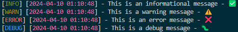

# Simple Logger

Simple Logger is a lightweight and easy-to-use logging library for Node.js applications. It provides a simple and intuitive way to log messages with different severity levels, format log messages, and rotate log files.

## Installation

To install Simple Logger, use npm:

```
npm install simple-logger
```

## Usage

First, require the `SimpleLogger` class in your Node.js application:

```javascript
const SimpleLogger = require("simple-logger") // CommonJS

import SimpleLogger from "simple-logger" // ES6 module
```

Then, create an instance of the `SimpleLogger` class with the desired configuration options:

```javascript
const logger = new SimpleLogger({
  logLevel: "debug",
  logFile: "app.log",
  logFormat: "[{level}] [{timestamp}] - {message} - {emoji}",
  dateFormat: "yyyy-mm-dd HH:MM:ss",
  maxFileSize: 1024 * 1024 * 5, // 5MB
  maxFiles: 3,
})
```

Now you can use the logger instance to log messages with different severity levels:

```javascript
logger.info("This is an informational message")
logger.warn("This is a warning message")
logger.error("This is an error message")
logger.debug("This is a debug message")
```

The log messages will be outputted to the console and written to the specified log file.

## Output Examples

Here are some examples of how the log messages will be outputted using Simple Logger:



The log messages include the following components:

- Log Level: The severity level of the message, displayed in uppercase and colored based on the level.
- Timestamp: The timestamp of when the log message was generated, formatted according to the `dateFormat` configuration option.
- Message: The actual log message.
- Emoji: An emoji corresponding to the log level, providing a visual indication of the message severity.

The log messages will be outputted to the console and written to the specified log file (if configured) in the same format.

## Configuration Options

The `SimpleLogger` class accepts the following configuration options:

- `logLevel` (string, default: `'info'`): The minimum severity level of messages to log. Can be one of `'error'`, `'warn'`, `'info'`, or `'debug'`.
- `logFile` (string, default: `null`): The path to the log file. If not specified, logs will only be outputted to the console.
- `logFormat` (string, default: `'[{level}] [{timestamp}] - {message} - {emoji}'`): The format of the log messages. You can use placeholders `{level}`, `{timestamp}`, `{message}`, and `{emoji}` to customize the format.
- `dateFormat` (string, default: `'yyyy-mm-dd HH:MM:ss'`): The format of the timestamp in log messages.
- `maxFileSize` (number, default: `1024 * 1024 * 10`): The maximum size (in bytes) of the log file before it gets rotated.
- `maxFiles` (number, default: `5`): The maximum number of rotated log files to keep.

## Log Levels

Simple Logger supports the following log levels, in decreasing order of severity:

- `error`: Error messages.
- `warn`: Warning messages.
- `info`: Informational messages.
- `debug`: Debug messages.

## Log File Rotation

Simple Logger automatically rotates the log file when it reaches the specified maximum size. The rotated log files are named with a numbered suffix (e.g., `app.log.1`, `app.log.2`, etc.). The number of rotated log files is limited by the `maxFiles` configuration option.

## License

Simple Logger is released under the [MIT License](https://opensource.org/licenses/MIT).
